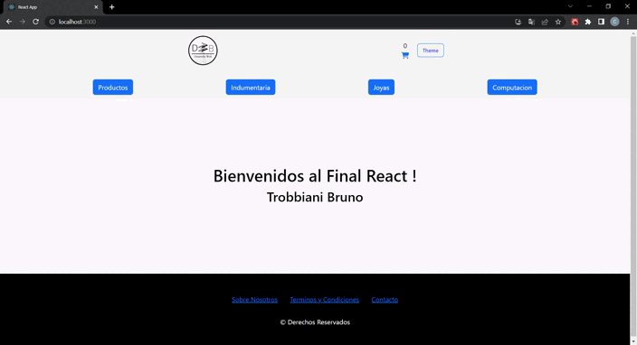
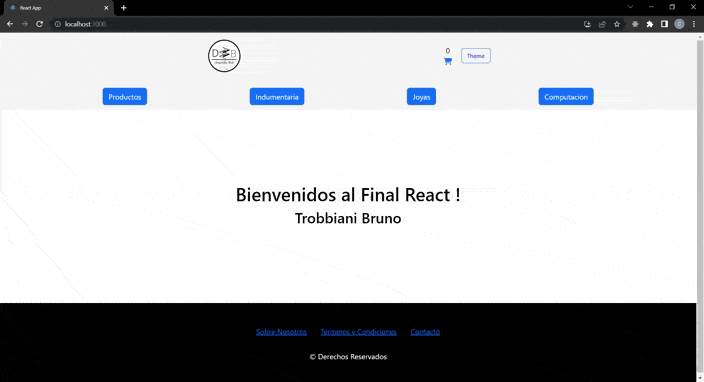

# Proyecto Final de React

Proyecto construido con Create-React-App a modo de demostrar lo aprendido en el curso de React

## Instalacion:

* 1 - Descarga el repositorio de github en tu ordenador (Branch Master !).
* 2 - Inicia en la Consola de Comandos ***npm i*** para instalar las dependencias.
* 3 - Al finalizar la instalacion de dependencias, inicia el comando ***npm start***.
* 4 - Si todo esta correcto se abrirá un navegador con la direccion ***localhost:3000***.
* 5 - Ya puedes usar la aplicacion.

## Navegacion y usos de la App:

### Importante !

*Esta aplicacion se contruyo unicamente para mostrar lo aprendido en Curso de React por lo que no genera cargos economicos alguno de su uso*

**No deberias agregar datos sesibles en el proceso que simula la compra**

### Navegavilidad General:

***Tanto los precios como la cantidad de stock de cada producto son complemente de referencia***

### Pasos para agregar un producto:

* Ten en cuenta que dar de alta productos afecta directamente a la base de datos. También las consideraciones de tamaño de imagenes, (pie del formulario de "Agregar Producto"), al momento de subir la imagen identificativa del producto.

### Recomendaciones !

* 1 - Las imagenes correspondientes a los productos deben tener un tamaño de 150px de ancho al menos.
Puedes editar fotos gratuitamente desde este enlace:
[Photopea](https://www.photopea.com/)

***Una vez cargado el archivo, en Archivo-Exportar Como - PNG (especifica el ancho de la imagen en 150px.) Luego Guardar***

*El Archivo Renderizado por la Aplicacion Photopea, es el indicado para la imagen del producto*
            
* 2 - El formato de dicha imagen debe estar con fondo transparente. Puedes quitar el fondo de una imagen completamente gratis desde esta web: 
[RemoveBG](https://www.remove.bg/es)

### Eliminar Productos:

* Ten en cuenta que eliminar un producto, no se puede deshacer !!!. Modifica directamente la base de datos dando de baja ese Producto.

### Proceso de Compra de Prodcutos:

    
### Recomendaciones !
* A modos demostrativos puedes usar este numero de tarjeta para comprobar el Checkout de la compra:
* Numero de Tarjeta: 1234658987541458
* CVC: 123

***No dejes datos sensibles en estos campos***
***Recurda que es unicamente con proposito de evaluacion***

